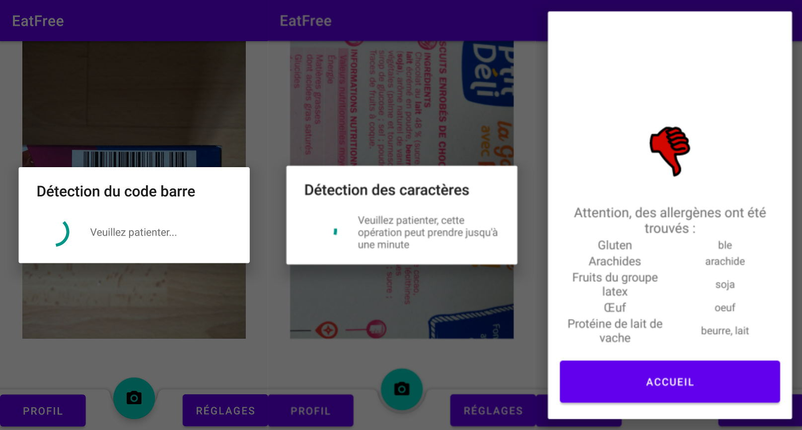

# EatFree

**EatFree** est une **application Android** ayant pour but l'**information** de l'utilisateur quant à la **présence d'allergènes dans un produit alimentaire**, en utilisant le scan de code-barre du produit et la base de données ouvertes OpenFoodFacts, ou la reconnaissance de caractères de la liste d'ingrédients de l'emballage.

Ce projet a été réalisé en groupe de 8 de l'IUT du Puy-en-Velay, en collaboration avec les étudiants de l'ESEPAC.

